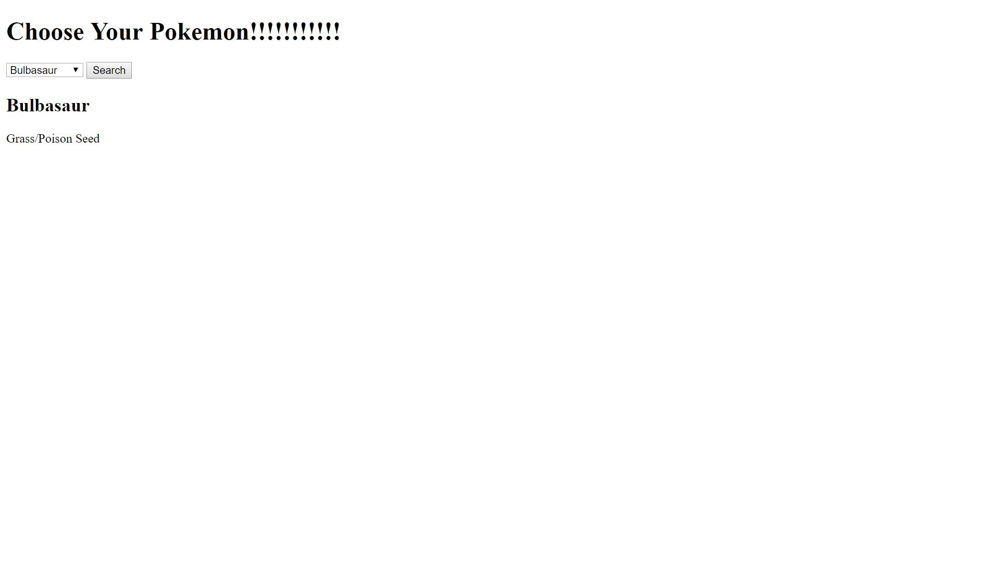

## Installation

1. Clone repo
2. run `npm install`

## Usage

1. run `node server.js`
2. Navigate to `localhost:8000`

Pokemon API

When selecting a Pokemon name you will be able to see what type and category that Pokemon is
so if you're a novice you can come and find out about some of the base Pokemon.

How It's Made:

Tech used:HTML, CSS, Javascript, Node

Html was used to make a dropdown menu which enables users to select which Pokemon information would
be displayed for. Javascript was used to create the onclick event which sends a request to the server and also which printed the information to the DOM. Node was used to handle the server response and write back the information about each Pokemon.

Optimizations

I would like to add more Pokemon because right now I only have the 4 main Pokemon so this app caters to Pokemon novices but once people get a little bit of experience they will want to know information about more Pokemon so that's a goal for me to provide that. I would also like to add pictures of Pokemon so novices can know what these Pokemon look like.

Lessons Learned:
This was my second project incorporating the backend. I learned how to incorporate more than one HTML page in my node locally hosted server. If you check my rockpaper project I wasn't able to do that so i've made progress.
